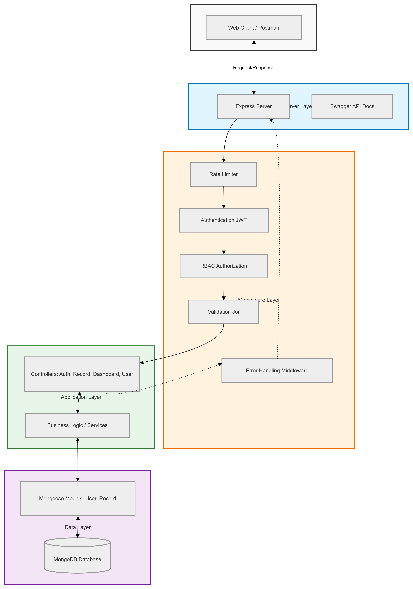

# Finance Dashboard Backend API

## 🚀 Overview
This project is a backend system for a finance dashboard that allows users to manage financial records and view analytics based on their roles.

It demonstrates backend engineering concepts such as API design, role-based access control (RBAC), validation, and data aggregation.

---

## 🛠️ Tech Stack
- Node.js
- Express.js
- MongoDB (Mongoose)
- JWT Authentication
- Joi Validation
- Swagger API Docs

---

## ⚙️ Features

### 1. Authentication
- User registration and login
- JWT-based authentication
- Secure password hashing (bcrypt)

---

### 2. Role-Based Access Control (RBAC)
- Viewer → Read-only access
- Analyst → View records + analytics
- Admin → Full access (CRUD + user management)

---

### 3. Financial Records Management
- Create, read, update, delete records
- Soft delete support
- Filtering:
  - Type (income/expense)
  - Category
  - Date range
- Pagination support

---

### 4. Dashboard Analytics
- Total income
- Total expenses
- Net balance
- Category-wise breakdown
- Monthly trends

---

### 5. Validation & Error Handling
- Joi-based request validation
- Centralized error handling middleware
- Proper HTTP status codes

---

### 6. Security
- JWT authentication middleware
- Role-based authorization middleware
- Ownership validation (users can access only their data)
- Rate limiting

---

## 📡 API Endpoints

### Auth
- POST `/api/auth/register`
- POST `/api/auth/login`

### Records
- POST `/api/records`
- GET `/api/records`
- PUT `/api/records/:id`
- DELETE `/api/records/:id`

### Dashboard
- GET `/api/dashboard`
- GET `/api/dashboard/categories`
- GET `/api/dashboard/trends`
- GET `/api/dashboard/balance`

### Users (Admin only)
- GET `/api/users`
- PATCH `/api/users/:id/role`
- PATCH `/api/users/:id/toggle`

---

## 📊 API Documentation
Swagger available at: # Finance Dashboard Backend API

## 🚀 Overview
This project is a backend system for a finance dashboard that allows users to manage financial records and view analytics based on their roles.

It demonstrates backend engineering concepts such as API design, role-based access control (RBAC), validation, and data aggregation.

---

## 🛠️ Tech Stack
- Node.js
- Express.js
- MongoDB (Mongoose)
- JWT Authentication
- Joi Validation
- Swagger API Docs

---

## ⚙️ Features

### 1. Authentication
- User registration and login
- JWT-based authentication
- Secure password hashing (bcrypt)

---

### 2. Role-Based Access Control (RBAC)
- Viewer → Read-only access
- Analyst → View records + analytics
- Admin → Full access (CRUD + user management)

---

### 3. Financial Records Management
- Create, read, update, delete records
- Soft delete support
- Filtering:
  - Type (income/expense)
  - Category
  - Date range
- Pagination support

---

### 4. Dashboard Analytics
- Total income
- Total expenses
- Net balance
- Category-wise breakdown
- Monthly trends

---

### 5. Validation & Error Handling
- Joi-based request validation
- Centralized error handling middleware
- Proper HTTP status codes

---

### 6. Security
- JWT authentication middleware
- Role-based authorization middleware
- Ownership validation (users can access only their data)
- Rate limiting

---

## 📡 API Endpoints

### Auth
- POST `/api/auth/register`
- POST `/api/auth/login`

### Records
- POST `/api/records`
- GET `/api/records`
- PUT `/api/records/:id`
- DELETE `/api/records/:id`

### Dashboard
- GET `/api/dashboard`
- GET `/api/dashboard/categories`
- GET `/api/dashboard/trends`
- GET `/api/dashboard/balance`

### Users (Admin only)
- GET `/api/users`
- PATCH `/api/users/:id/role`
- PATCH `/api/users/:id/toggle`

---

## 📊 API Documentation
Swagger available at:# Finance Dashboard Backend API

## 🚀 Overview
This project is a backend system for a finance dashboard that allows users to manage financial records and view analytics based on their roles.

It demonstrates backend engineering concepts such as API design, role-based access control (RBAC), validation, and data aggregation.

---

## 🛠️ Tech Stack
- Node.js
- Express.js
- MongoDB (Mongoose)
- JWT Authentication
- Joi Validation
- Swagger API Docs

---

## ⚙️ Features

### 1. Authentication
- User registration and login
- JWT-based authentication
- Secure password hashing (bcrypt)

---

### 2. Role-Based Access Control (RBAC)
- Viewer → Read-only access
- Analyst → View records + analytics
- Admin → Full access (CRUD + user management)

---

### 3. Financial Records Management
- Create, read, update, delete records
- Soft delete support
- Filtering:
  - Type (income/expense)
  - Category
  - Date range
- Pagination support

---

### 4. Dashboard Analytics
- Total income
- Total expenses
- Net balance
- Category-wise breakdown
- Monthly trends

---

### 5. Validation & Error Handling
- Joi-based request validation
- Centralized error handling middleware
- Proper HTTP status codes

---

### 6. Security
- JWT authentication middleware
- Role-based authorization middleware
- Ownership validation (users can access only their data)
- Rate limiting

---

## 📡 API Endpoints

### Auth
- POST `/api/auth/register`
- POST `/api/auth/login`

### Records
- POST `/api/records`
- GET `/api/records`
- PUT `/api/records/:id`
- DELETE `/api/records/:id`

### Dashboard
- GET `/api/dashboard`
- GET `/api/dashboard/categories`
- GET `/api/dashboard/trends`
- GET `/api/dashboard/balance`

### Users (Admin only)
- GET `/api/users`
- PATCH `/api/users/:id/role`
- PATCH `/api/users/:id/toggle`

---

## 📊 API Documentation
Swagger available at: http://localhost:3000/api-docs


---

## ⚡ Setup Instructions

```bash
git clone <repo-url>
cd finance-backend
npm install
```
## Create .env file:
MONGO_URI=your_mongodb_uri
JWT_SECRET=your_secret
PORT=3000

## Run server
```bash
npm run dev
```

## 🧠 Architecture Highlights
Clean separation of concerns (routes → middleware → controllers → DB)
Centralized validation and error handling
Modular and scalable folder structure
Optimized aggregation queries for analytics


